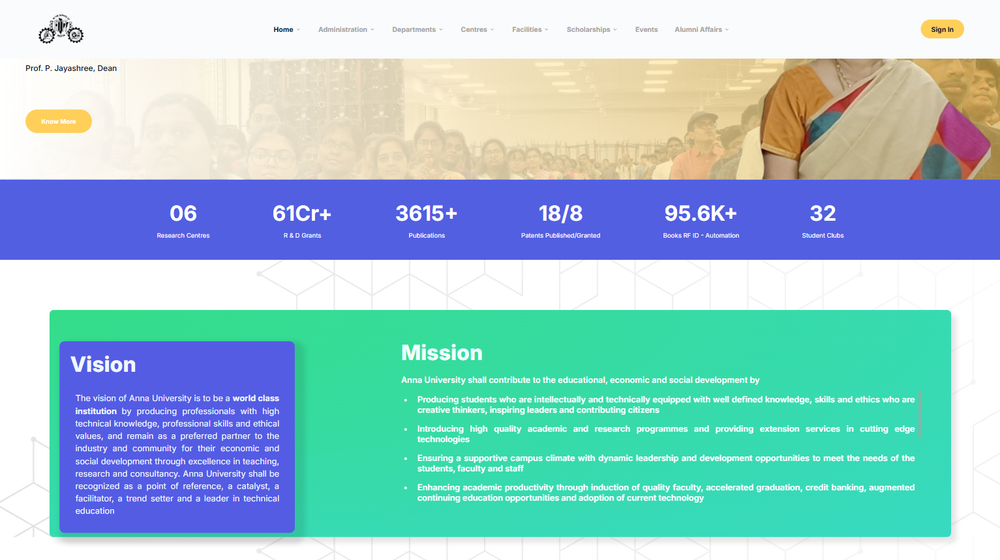
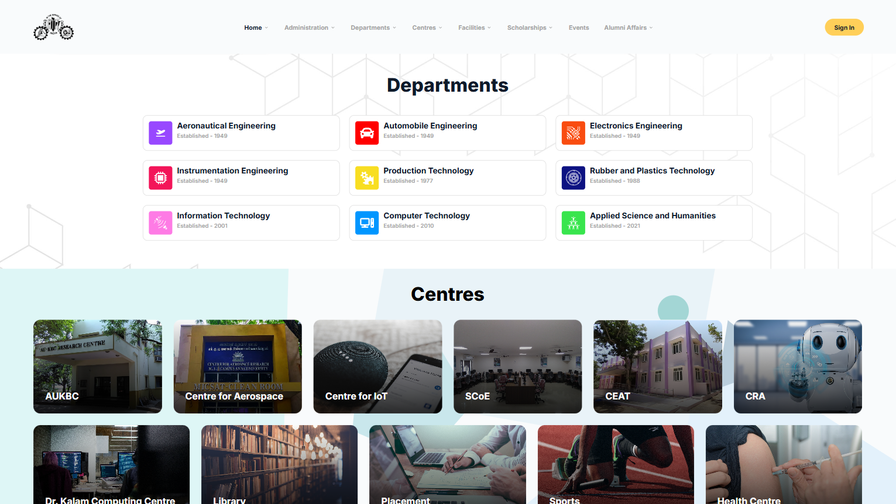

# 🌐 MIT Website (Frontend)

This repository contains the **frontend source code** for the official website of **MIT Campus, Anna University** — [mitindia.edu](https://www.mitindia.edu).  

⚡️ Please note:  
- This repository is an **older version** of the live website.  
- It contains **only the frontend** to conform with university regulations.  
- The live website is actively maintained by the **Web Team, MIT Campus, Anna University**, which was set up by me.  

---

## 🛠 Tech Stack

- ⚛️ **React 18**  
- 📘 **TypeScript**  
- 🎨 Minimal external dependencies (most UI components are **custom-built**)  
- 📱 **Fully responsive** design for mobile, tablet, and desktop  

---

## 🌟 Highlights

- 🎓 Modern, accessible, and scalable website for MIT Campus  
- 🧩 Custom-built UI components (lightweight, dependency-free where possible)  
- 📱 Responsive across devices & screen sizes  
- ⚡️ Fast-loading, optimized frontend  
- 🛡 University-compliant design and deployment  

---

## 🖼 Screenshots

### Homepage
<div style="width:100%;margin:16px 0">
  <figure style="width:100%;margin:0">
    <a href="./screens/home.png"></a>
    <figcaption style="font-size:0.95em;margin-top:6px">`home.png` — Landing page of the MIT Website</figcaption>
  </figure>
</div>
<div style="width:100%;margin:16px 0">
  <figure style="width:100%;margin:0">
    <a href="./screens/home2.png"></a>
    <figcaption style="font-size:0.95em;margin-top:6px">`home.png` — Landing page of the MIT Website</figcaption>
  </figure>
</div>

### Department Page
<div style="width:100%;margin:16px 0">
  <figure style="width:100%;margin:0">
    <a href="./screens/departments.png"></a>
    <figcaption style="font-size:0.95em;margin-top:6px">`department.png`</figcaption>
  </figure>
</div>

---

## ⚡️ Prerequisites

- Node.js (16+)  
- npm or pnpm  

---

## 🚀 Getting Started

### ▶ Run in development
```powershell
npm run dev
````

### 🏗 Build

```powershell
npm run build
```

### 🔍 Preview production build

```powershell
npm run preview
```

---

## 📂 Project Layout (Important Folders)

```
src/                  # Main frontend app
  ├─ components/      # Custom React UI components
  ├─ pages/           # Page components (Home, Departments, etc.)
  └─ assets/          # Static files (images, logos, etc.)
```

---

## 📚 Notes

* This repo **does not include backend or deployment configurations**.
* The production site is maintained separately by the **Web Team, MIT Campus**, which I am not a part of post graduation.